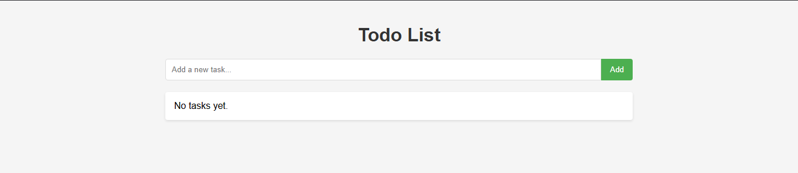

# Flask Todo App Deployment Guide

## Overview
This repository contains a simple **Flask Todo App** deployed on **Rocky Linux** using **MySQL, Nginx, and Gunicorn**. This guide provides step-by-step instructions for setting up and running the application in a production environment.

## Features
- Task management (Add, View, Delete)
- Uses MySQL as the database
- Deployed with **Gunicorn** and **Nginx**
- SELinux and Firewall configuration for security

# Blog Post
check out full blog post for more details: [Deploying a Flask Todo App with MySQL, Nginx, and Gunicorn on Rocky Linux](https://netopsautomation.com)
